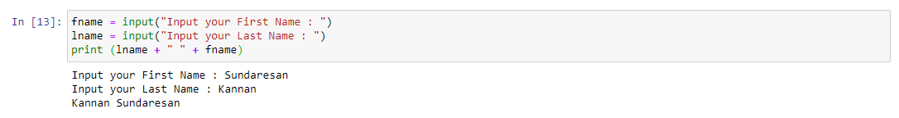
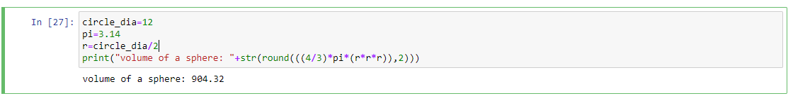

Task 1:2 
"Write a program which will find all such numbers which are divisible by 7 but are not a multiple
of 5, between 2000 and 3200 (both included). The numbers obtained should be printed in a
comma-separated sequence on a single line."

Task 1:3
"Write a Python program to accept the user's first and last name and then getting them printed in
the the reverse order with a space between first name and last name."

Task 1:4
"Write a Python program to find the volume of a sphere with diameter 12 cm.
Formula: V=4/3 * π * r^3."

